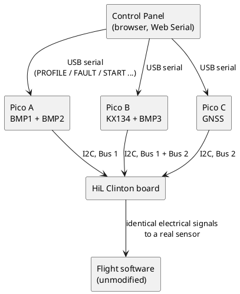
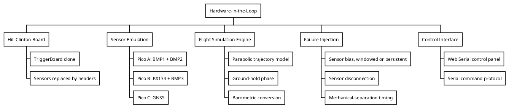

# How to Do Hardware-in-the-Loop (HiL) Testing

## Purpose

This guide explains, step by step, how the Hardware-in-the-Loop (HiL) test bench for the TriggerBoard was built, how it works internally, and how to use it to test the flight software against a wide range of flight profiles and sensor failures — all on the ground, without ever needing a real rocket. It is written for a teammate with basic software and hardware skills who has never touched this system before.

If you haven't yet, read the [TriggerBoard wiki page](/competition/firehorn/recovery/trigger-board) first — this guide assumes you already know what the TriggerBoard does and what sensors it uses.

## Why HiL?

Looking back at the TriggerBoard's own history is the best way to understand why this exists. The V3 board flew on a second Test Flight and failed for two completely different reasons: one board's wall-mounted jack connections were too flimsy and it lost power mid-flight, and the second board — although it physically survived — had **the wrong code uploaded to it**. That second failure is exactly the kind of mistake HiL exists to catch: a software problem that a bit more testing on the ground would have revealed before the rocket ever left the pad.

Until now, the only way to validate the TriggerBoard's flight software was to fly it — in a test rocket or a balloon drop test. Each of those tests is expensive, slow to organize, and only exercises one specific flight profile. If someone changes the code two days before a launch, there has historically been no good way to check that the change is safe.

HiL solves this by replacing the TriggerBoard's sensors with microcontrollers that pretend to be those sensors. The flight software runs completely unmodified — it has no idea it isn't really flying — while we feed it whatever altitude profile, sensor failure, or edge case we want to test, on a table, in a few minutes.

> This system tests the **software's logic**, not the physical robustness of the board (solder joints, connector reliability, vibration resistance). It complements real flight tests; it does not replace them. {.is-info}

## System Architecture

### The HiL Clinton board

A copy of the TriggerBoard was made with every sensor removed and replaced by a pin header in its place. This board, nicknamed **HiL Clinton**, receives exactly the same I2C and GPIO signals the real sensors would produce — except those signals now come from three Raspberry Pi Pico 2 boards instead of real chips.

> 📸 **INSERT PHOTO**: top-down shot of the HiL Clinton board with each sensor header clearly visible and labelled (KX134, BMP1, BMP2, BMP3, EEPROM, GNSS, SEP_MECHD). {.is-info}

### The five emulated sensors

The TriggerBoard has 6 external inputs across two I2C buses. Five of them are emulated; the EEPROM stays a real physical component (its "failure" is instead simulated with a jumper that changes its address, tricking the flight software into thinking it can't find it).

| Sensor | I2C address | Physical bus | Emulated by | Used in flight logic? |
|---|---|---|---|---|
| BMP581 #1 | `0x47` | Bus 1 | Pico A | Yes — altitude |
| BMP581 #2 | `0x46` | Bus 1 | Pico A | Yes — altitude |
| BMP581 #3 | `0x47` | Bus 2 | Pico B | Yes — altitude |
| KX134 (accelerometer) | `0x1E` | Bus 1 | Pico B | No — datalogging only |
| GNSS (Quectel LC76G) | `0x50` / `0x54` | Bus 2 | Pico C | No — datalogging only |
| EEPROM | `0x51` | Bus 2 | *(physical, not emulated)* | Yes — flight state persistence |

That last column matters a lot for how much effort was put into each emulator: the three barometers feed the state machine that decides when to fire the pyro cutter, so they need to behave *exactly* like real BMP581s and output a physically plausible altitude. The KX134 and GNSS only feed datalogging, so they only need to satisfy their driver's startup checks — their actual data can be zeros.

### Why three Raspberry Pi Pico 2?

Each Pico 2 has exactly **two independent hardware I2C peripherals** (called `Wire` and `Wire1` in the Arduino core). With the standard `Wire` library, each peripheral can only answer to one I2C address at a time. Six addresses to emulate, two addresses per Pico, means three Pico boards — no more, no less.





## Hardware Setup {.tabset}

### Pico A

Hosts BMP1 and BMP2 (both on Bus 1), and drives the simulated `SEP_MECHD` signal.

| Pico A pin | Internal peripheral | Goes to | Role |
|---|---|---|---|
| GPIO4 | Wire (I2C0) | BMP1 header | SDA |
| GPIO5 | Wire (I2C0) | BMP1 header | SCL |
| GPIO6 | Wire1 (I2C1) | BMP2 header | SDA |
| GPIO7 | Wire1 (I2C1) | BMP2 header | SCL |
| GPIO2 | plain GPIO | `SEP_MECHD` test point (parallel to R7/J5) | Separation signal |
| GND | — | common ground | Ground reference |

### Pico B

Hosts KX134 (Bus 1) and BMP3 (Bus 2) — the only Pico that bridges both buses.

| Pico B pin | Internal peripheral | Goes to | Role |
|---|---|---|---|
| GPIO4 | Wire (I2C0) | KX134 header | SDA |
| GPIO5 | Wire (I2C0) | KX134 header | SCL |
| GPIO6 | Wire1 (I2C1) | BMP3 header | SDA |
| GPIO7 | Wire1 (I2C1) | BMP3 header | SCL |
| GND | — | common ground | Ground reference |

### Pico C

Hosts both halves of the GNSS emulation (one physical chip, two I2C addresses).

| Pico C pin | Internal peripheral | Goes to | Role |
|---|---|---|---|
| GPIO4 | Wire (I2C0, addr `0x50`) | GNSS header | SDA |
| GPIO5 | Wire (I2C0, addr `0x50`) | GNSS header | SCL |
| GPIO6 | Wire1 (I2C1, addr `0x54`) | GNSS header (same connector as above) | SDA |
| GPIO7 | Wire1 (I2C1, addr `0x54`) | GNSS header (same connector as above) | SCL |
| GND | — | common ground | Ground reference |

> 📸 **INSERT PHOTO**: close-up of the "shared bus" wiring — two Pico pins joined into a single wire going to one connector on HiL Clinton. This is the trickiest wiring detail in the whole setup and deserves a clear picture. {.is-info}
{.tabset-end}

### The "one bus, two addresses" trick

Notice that Pico A's BMP1 and BMP2 are on *different physical connectors* on HiL Clinton, but Pico C's two GNSS addresses share the *same single connector*. This is because on the real board, BMP1 and BMP2 are two separate chips already wired together on the same bus, while the GNSS module is a single chip that happens to answer on two addresses. Concretely:

- For Pico A/B, each emulated device's SDA/SCL goes to its own labelled connector; the HiL Clinton PCB itself joins the ones that share a bus internally.
- For Pico C, both device instances' SDA lines must physically meet at the *same* connector pin (and likewise for SCL) — you need a proper 3-way junction (a breadboard row, a small terminal block, or two wires soldered together with heat-shrink), not two separate connections.

> Don't just connect Pico C's GPIO4 and GPIO6 to two different points and hope — you need one wire from GPIO4, one from GPIO6, and one going out to the connector, all three joined at the same electrical node. {.is-warning}

### A hardware gotcha worth knowing about

If a bus that should clearly work (correct pins, correct address, correct pull-ups) stays completely silent, don't rule out a wiring problem too quickly if you're on a Seeed XIAO RP2350-based master board: its default I2C0 (`Wire`) pins are routed to two tiny landing pads on the *back* of the board, not to the front castellated header — easy to miss, and easy to solder onto poorly. This exact issue cost real debugging time during development; a bad solder joint there was eventually the actual root cause of "GNSS Pico randomly not detected."

## Firmware Architecture

The full, up-to-date source for all three Pico is on the [team's GitHub](https://github.com/EPFLRocketTeam/2025_C_RE_Trigger_Board) (see the `HiL` folder). This section explains how it's built and why, so you can read or modify it with confidence rather than treating it as a black box.

### Reusable emulator classes

Rather than duplicating logic three times, each sensor type has its own C++ class (`Bmp580Emulator`, `Kx134Emulator`) that wraps:
- an I2C register table (`registers[256]`) — the same "memory map" the real chip would expose,
- the `Wire.onReceive()` / `Wire.onRequest()` callbacks that the Arduino I2C library calls when the master writes to or reads from the device,
- a small watchdog that restarts the I2C peripheral if it goes quiet for more than 3 seconds (handles the master resetting or getting out of sync).

```cpp
// Simplified sketch of the pattern every sensor class follows
class Bmp580Emulator {
public:
  void begin(TwoWire &bus, uint8_t sda, uint8_t scl, uint8_t addr, ...);
  void poll(float altitude_m, float t);          // called every loop()
  void handleReceive(int numBytes);              // I2C write from the master
  void handleRequest();                          // I2C read from the master
private:
  volatile uint8_t registers[256];
  volatile uint8_t regPointer;
};
```

### The lesson that shaped this whole design: reset defaults matter

The single biggest source of bugs during development was **silicon reset defaults**. A real BMP581, right after power-up or a soft-reset command, doesn't have every register at `0x00` — some registers come up with specific non-zero bit patterns baked into the hardware. The Bosch driver library checks these values as part of its startup sequence; if the emulator naively zeroed everything, the driver would get stuck in an infinite configuration retry loop, waiting forever for a register value that would never appear on real silicon either.

The fix was to look up the real datasheet's register map and hard-code the *actual* power-on-reset values:

```cpp
#define ODR_CONFIG_RESET_VAL 0x70  // NOT 0x00 - deep_dis=0, default odr, pwr_mode=STANDBY
#define DSP_CONFIG_RESET_VAL 0x03  // NOT 0x00 - two reserved bits are hardwired to 1
```

The same lesson reappeared, in a different shape, for the KX134: its software-reset bit (`SRST`, bit 7 of register `CNTL2`) stays at `1` on real hardware until the chip's internal reboot finishes — the driver actively polls for it to clear. The emulator has to simulate that "reboot" instantly and clear the bit itself, or the driver hangs forever waiting for a bit that will never flip.

> If you ever add a new emulated sensor and its driver "just hangs" on `begin()`, check the datasheet's register reset table before anything else. It was the root cause almost every single time. {.is-warning}

### GNSS: a different protocol entirely

The Quectel LC76G doesn't expose a normal register map over I2C. It uses three separate addresses:

| Address | Role |
|---|---|
| `0x50` | Configuration — the master writes small command packets here |
| `0x54` | Read — the master requests either "how many bytes are available" or the actual NMEA data |
| `0x58` | Write — the master writes NMEA/PQTM command text here |

Tracing through the flight software's own `LC76G.ino` revealed something important: `check_connection()` — the check that, if it fails, halts the whole board with a buzzer forever — only pings address `0x50`. Everything that touches `0x54` and `0x58` already fails gracefully in the flight code if there's no response (a `NACK` is silently treated as "zero bytes available"). That means the emulator only needs to make address `0x50` answer; the other two can be left completely unimplemented without breaking anything, which is exactly what keeps the GNSS Pico's firmware simple.

## The Flight Simulation Engine

### A trajectory from three numbers

Rather than requiring a full recorded flight log, each Pico that feeds altitude data computes a simple, physically-grounded trajectory in real time from just three parameters:

| Parameter | Meaning |
|---|---|
| Boost acceleration | Constant upward acceleration during motor burn (m/s²) |
| Boost duration | How long the boost phase lasts (s) |
| Drogue descent rate | Constant downward speed once the drogue deploys at apogee (m/s) |

The physics: during boost, altitude follows `0.5 × a × t²`. After boost, the rocket coasts upward under gravity alone until its velocity reaches zero (apogee). From apogee onward, altitude decreases at the fixed drogue rate rather than continuing to accelerate downward in free-fall — this matters because a pure free-fall model would make the descent unrealistically fast and give the flight software far less time than a real drogue descent would.

This simulated altitude is converted into a pressure reading via the standard barometric formula before being written into the emulated BMP581's registers, so from the flight software's point of view it's reading a completely ordinary pressure sensor.

### The ground-hold phase

Every test also has a configurable "ground hold" duration — a period, before liftoff, where the simulated altitude stays flat at zero. This exists specifically so a sensor fault can already be present *before the rocket even leaves the pad*, to test things like the flight software's ground-altitude calibration and outlier-sensor rejection under a pre-existing fault, not just faults that appear mid-flight.

## Failure Injection

Three independent kinds of failure can be scheduled, each with its own timing model:

| Failure type | Applies to | Timing reference | Notes |
|---|---|---|---|
| Sensor bias | BMP1 / BMP2 / BMP3 | Relative to liftoff (t=0); can be negative to start before liftoff, or "persistent" to be always active | Simulates a barometer reading a constant pressure offset |
| Sensor disconnection | BMP1 / BMP2 / BMP3 / KX134 / GNSS | Relative to the moment the command is uploaded, independent of the flight clock | Simulates a cut wire or a cold solder joint — the I2C peripheral is shut down entirely, so the master gets no response at all |
| Mechanical separation | — (GPIO signal, not a sensor) | Relative to the *simulated* apogee, can be before/at/after | Simulates the parachute-deployment safety jack pulling free |

> Disconnection and bias faults intentionally use *different* time references. Bias faults are about "what does the flight see mid-flight", so they're anchored to liftoff. Disconnections are about "is this thing already broken before we even start", so they're anchored to the moment you hit upload — this lets you test a sensor that's dead from the very first line of the flight software's boot sequence. {.is-info}

### The serial command protocol

All three Pico listen for the same small set of plain-text commands over their USB serial connection, one per line:

```
PROFILE BOOST_ACCEL=<m/s2> BOOST_T=<s> DROGUE_RATE=<m/s> REST=<s>
FAULT <BMP1|BMP2|BMP3> BIAS=<Pa> START=<s> DURATION=<s>
FAULT <BMP1|BMP2|BMP3> BIAS=<Pa> PERSISTENT
FAULT <BMP1|BMP2|BMP3> CLEAR
DISCONNECT <BMP1|BMP2|BMP3|KX|GNSS> AT=<s>
DISCONNECT <BMP1|BMP2|BMP3|KX|GNSS> CLEAR
SEPMEC OFFSET=<s>
START
RESET
```

Because these are just plain text lines, you can test any of them by hand from the Arduino IDE's own Serial Monitor without touching the control panel at all — useful when debugging a single Pico in isolation.

## The Control Panel

Rather than reflashing a Pico's firmware every time a parameter changes, a small browser-based control panel pushes configuration over USB serial in milliseconds, using the browser's Web Serial API (Chrome or Edge only). This means changing a flight profile and re-running a test takes seconds, not a full recompile-and-flash cycle.

> 📸 **INSERT SCREENSHOT**: the full control panel with all panels visible (Pico connection cards, flight profile, fault injection, SEPMEC, disconnection, journal). {.is-info}

The panel is organized top to bottom, matching the order you'd naturally configure a test in:

1. **Pico connection cards** — one "Connect" button per Pico; the browser will ask you to pick the matching serial port the first time.
2. **Flight profile** — boost acceleration/duration, drogue descent rate, ground-hold time, with a live-computed preview of apogee altitude, apogee time, and time to landing.
3. **Fault injection** — per barometer: enable, pressure offset, start time (leave blank for "already active"), duration.
4. **Mechanical separation** — nominal / before / after apogee, with a live summary of exactly what will be sent, to avoid accidentally re-using a stale setting from a previous test.
5. **Sensor disconnection** — per sensor (all five): enable and delay after upload.
6. **Upload / Reset buttons**, a status banner, and a running log of everything sent and received.

> Web Serial needs a real top-level browser tab — it won't work embedded inside another app's preview pane. Just open the `.html` file directly in Chrome or Edge (double-click works fine). {.is-warning}

## Step-by-Step: Running Your First Test

1. **Flash all three Pico** with their respective firmware from the GitHub `HiL` folder.
2. **Wire HiL Clinton to the three Pico** following the pinout tables above, plus a shared ground.
3. **Wire the TriggerBoard's flight software target** (a real TriggerBoard, or the HiL Clinton board acting as one) to power and USB, but don't power it on yet.
4. **Open the control panel** `.html` file in Chrome, and click "Connect" for each of the three Pico.
5. **Set your flight profile** — start with something gentle (e.g. 80 m/s² boost for 3s) and check the computed apogee looks reasonable.
6. **(Optional) Add a fault or a disconnection** if that's what you're testing this run.
7. **Click "Téléverser"** — this pushes the configuration to all connected Pico and starts the simulated flight clock on all of them.
8. **Power on the flight board.** It will boot, detect all its "sensors" as if they were real, and begin executing its normal state machine.
9. **Watch the flight board's own SD log / serial output** — it should transition through its states (STANDBY → FLIGHT → FIRST_EVENT → SECOND_EVENT) exactly as it would on a real flight, timed to the profile you set.
10. **Click "Reset"** before starting a new test — it clears all faults, disconnections, and the flight clock on every connected Pico in one click.

> 📸 **INSERT SCREENSHOT**: the journal panel mid-test, showing a real sequence of PROFILE/FAULT/START commands being sent and the Pico's own debug output coming back. {.is-info}

## Troubleshooting & Lessons Learned

A distilled list of the real problems hit while building this, in case they resurface:

| Symptom | Likely cause | Fix |
|---|---|---|
| A sensor is "not found" right after a soft-reset, but was fine before | Register reset defaults weren't set to the real silicon value (see [Firmware Architecture](#the-lesson-that-shaped-this-whole-design-reset-defaults-matter)) | Check the datasheet's power-on-reset table for that register |
| One specific bus is completely silent, even with correct pins/address/pull-ups | On XIAO RP2350 master boards, default I2C0 pins are on hard-to-solder back pads | Verify continuity with a multimeter, not just a visual check of the wire |
| A Pico's COM port changes after every reflash | Normal USB re-enumeration on reset — not a bug | Just reconnect that Pico in the control panel |
| Uploading a profile silently does nothing | An error on one Pico can abort the whole upload sequence without visible feedback | Make sure you're on the current control panel version — it now isolates failures per-Pico and shows a clear status banner |
| A scheduled failure (SEPMEC, fault) fires at the wrong time | Mixing up which of the two time references a setting uses (liftoff-relative vs. upload-relative — see the [Failure Injection](#failure-injection) table) | Check the live summary line in the control panel before uploading |
| A long test session becomes sluggish in the browser | The log was growing unbounded, forcing constant re-layout | Already fixed — the journal is capped and old lines drop off automatically |

## Future Improvements

A few ideas for anyone picking this up next:

- **Uploadable flight-log files**: replaying a real recorded flight's actual sensor data instead of the parametric model, once the team's datalogging format is standardized enough to parse reliably.
- **CI integration**: automatically running a standard battery of HiL scenarios whenever the flight software repository changes, catching regressions before they're even manually tested.
- **Hardware time sync**: a shared GPIO pulse between the three Pico for perfectly simultaneous liftoff timing, instead of the current few-millisecond skew from sequential serial commands (irrelevant at the scale of this system's altitude thresholds today, but worth knowing about if finer timing precision is ever needed).
